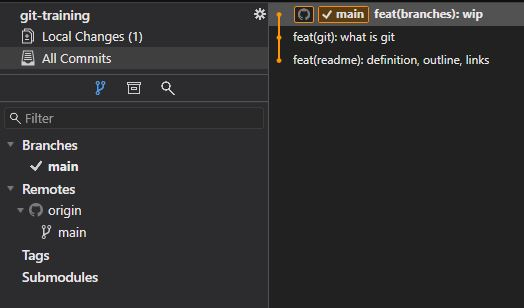
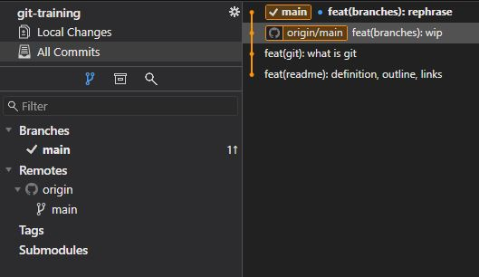
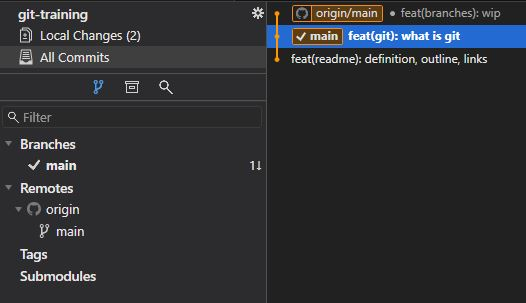

# Branches

- [Branches](#branches)
  - [What is a branch and what does it do?](#what-is-a-branch-and-what-does-it-do)
    - [Why "branch"?](#why-branch)
  - [Local vs remote branches](#local-vs-remote-branches)
  - [Working with branches (git branch & git checkout)](#working-with-branches-git-branch--git-checkout)
  - [Exercise](#exercise)

## What is a branch and what does it do?

A branch is an independent copy of the repository.

Every repo has at least one branch, the central default branch. This branch is usually called `main` (or `master`)[^1]. The main branch usually represents the production state of a repository (e.g. live application).

Most repos will also have a `develop` branch that usually represents the state of all fully developed and approved features.

Besides these two branches, a repo will often have multiple working branches as well. A working branch is used to develop a specific feature, implement a specific bug- or hotfix, prepare a specific release and so on. Since a branch is independent, all changes made on that branch, will not affect any other branch.

Therefore different contributors can work independently on files without the need to pay attention to someone else's changes.

Branches can be integrated into another branch by merging it. Usually merging is done via pull requests (PR), sometimes also called merge requests (MR). We'll explore that in depth in another chapter.

### Why "branch"?

Like a branch on a tree, a branch still belongs to the main codebase, the tree trunk.  
Like a tree, a repository can have many branches.  
Like a branch on a tree, branches can grow on other branches.

## Local vs remote branches

Most of the time, the repository will be hosted on a hosting service like Bitbucket; especially when multiple people want to work on it. When you make changes, these are only visible to you until you synchronize them to the upstream (remote) repository. If other contributors make and synchronize changes, you need to synchronize them to be able to see them.

> Synchronizing changes is done by
>
>- pushing (upload local changes to the upstream repo)
>- fetching (download changes on the upstream repo to your local copy)
>- pulling (like fetching, but will move your local branches to the latest commit)
>
>We will discuss these in depth in later chapters.

You can list all local and remote branches with the command `git branch -a`. Local branches are listed by name, the branch you are currently on, is prefixed with an asterisk (*) and in a different color. Branches of the upstream repository are listed as `remote/origin/{branchName}`, and in a different color.

In Fork, remote branches are listed as `origin/{branchName}` and prefixed with an icon; local branches are listed as `{branchName}`. If you are currently on the branch, the local branch is prefixed by a checkmark icon.

If the remote and local branch are on the same commit, in the tree view, the origin name is not displayed, only the icon.

  
*Remote and local branches in sync*

  
*Local branch is one commit ahead*

  
*Remote branch is one commit ahead*

>In VS Code, the branch you are currently on, is displayed on the left in the status bar (at the bottom).
>
>

## Working with branches (git branch & git checkout)

You can create a new branch either using the GUI or by running one of the following commands:

- `git branch {branch-name}`  
*Note that this command will only create the branch but will not check it out.*
- `git switch -c {branch-name}`
- `git checkout -b {branch-name}`

In Fork right-click on the commit (either in the list or the tree-view) and select `New Branch...`.

If you want to checkout an existing branch, you can run one of the following commands

- `git checkout {branch-name}`
- `git switch {branch-name}`

In Fork, double click on a branch, either in the list or on the tree. Alternatively right click on it and select `Checkout...`.

## Exercise

1. Create at least one `notes` branch and check it out.
2. Switch between branches and then back again to your new `notes` branch.
3. Use this branch to add personal notes.

---

[^1]: The standard used to be `master` - master/slave references were pretty common in technology - but now shifts towards the more descriptive and inclusive name `main`.

[continue to 'Workflow: Making changes'](workflow-making-changes.md)
