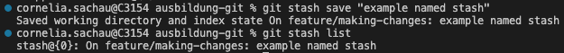

# Workflow: Making changes

- [Workflow: Making changes](#workflow-making-changes)
  - [Staging changes (git add)](#staging-changes-git-add)
    - [Staging via Command Line](#staging-via-command-line)
    - [Staging via VS Code](#staging-via-vs-code)
    - [Staging via Fork](#staging-via-fork)
  - [Keeping an overview](#keeping-an-overview)
    - [Status of current changes (git status)](#status-of-current-changes-git-status)
    - [History (git log)](#history-git-log)
    - [Details per line (git blame)](#details-per-line-git-blame)
  - [Committing changes (git commit)](#committing-changes-git-commit)
    - [Amending changes (--amend)](#amending-changes---amend)
  - [Stashing changes (git stash)](#stashing-changes-git-stash)
  - [Comparing changes (git diff)](#comparing-changes-git-diff)
  - [Reset (git reset)](#reset-git-reset)
    - [Soft reset](#soft-reset)
    - [Mixed reset](#mixed-reset)
    - [Hard reset](#hard-reset)
    - [Git reset in Fork](#git-reset-in-fork)
    - [Git reset in VS Code with GitLens](#git-reset-in-vs-code-with-gitlens)
  - [Revert (git revert)](#revert-git-revert)

Making changes to a repository takes more than saving a file - it contains of:

1. Make one or multiple changes to one or multiple files within the repository.
2. Save the files.
3. Stage your changes.
4. Commit the changes with a meaningful message.
5. Push the changes.

You can think of it as shopping for a present.

1. You browse the store.
2. You put items in your basket.
3. You buy (some of) the items.
4. You place (some of) the items into a parcel, wrap it and put a stamp on it.
5. You take the parcel to the post office and send it off.

Let's look at it in detail.

## Staging changes (git add)

Once you made changes, you need to stage them before you can commit them to the repository. This is the perfect time to review your changes and ensure that you want to commit them.

*If you are sure that you want to commit a specific change while working, you can stage the change right away. Any further changes can be made and easily reset to the staged version by discarding the (unstaged) change.*

### Staging via Command Line

To add changes of a specific file, type `git add <fileName.extension>`;  
*e.g. git add README.md*.

To add all changes of a specific folder, type `git add <directoryName>`;  
*e.g. git add assets*.

To add all changes, type `git add --all`.

If you want to only add specific changes of files, type `git add -p`. Then you can stage a change with `y`, ignore it with `n` or split it into smaller chunks with `s`. To exit this mode, type `q`.

### Staging via VS Code

You can stage your changes directly in your editor. Open the Source Control Panel on the Primary Sidebar.

All files that were modified are listed in the Changes section. If you click on a file, you can view the changed made in that file. Use the Plus icon to stage all changes of the file.

It is moved to the Staged Changes section. If you do not have any staged changes yet, the Staged Changes section is hidden. Use the Minus icon on a file in the Staged Changes section, to unstage the changes of that file.

### Staging via Fork

In Fork, open the Local Changes View. Files with changes are listed under Unstaged. Click on a file. You cann use the Stage button to stage all changes of the selected file. If you want to stage specific changes, you can hover over a change and use the Stage button there instead. You can also mark a change and use the Stage button that pops up.

Unstaging works the same way, use the Unstage buttons instead.

## Keeping an overview

### Status of current changes (git status)

On the Command Line, use the `git status` command to see which files have been modified and which modifications have been staged.

Both VS Code and Fork give you this overview automatically; see [Staging changes (git add)](#staging-changes-git-add) for further information.

### History (git log)

The `git log` command shows you the commit history of starting at the latest commit. It lists the commit author and the date of the commit. as well as the commit message and description.

In Fork, you can see a visual representation of this information.

### Details per line (git blame)

Use the `git blame <fileName.extension>` (*e.g.: git blame README.md*) command to view the commit id, commit author and date of the commit per line.

If you use the [GitLens — Git supercharged](https://marketplace.visualstudio.com/items?itemName=eamodio.gitlens) extension for VS Code, it will show you who and when this line was last changed, and the corresponding commit message.

With the extension enabled, you can also toggle on the File Blame using the File Annotations icon to the right above your editor window.

## Committing changes (git commit)

When you commit changes, you create a new snapshot of the repository.
Use the `git commit` command to do that. Every commit needs to have a commit message. If you use `git commit`, your text editor will open to let you enter the message. Alternatively, you can use the m-flag to add the message directly: `git commit -m "commit message"`.

You can also make a commit in VS Code's Source Control Panel. Enter your message and press the commit button.

In Fork, open the Local Changes View. In the bottom right corner you can add the commit message (Commit subject). You can add further information on the commit (Description).

### Amending changes (--amend)

You can make changes to an already existing commit. This alters the snapshot that you previously made. To do so, add the `--amend` flag, e.g. `git commit --amend`

In Fork, to amend changes to the previous commit, activate the Amend checkbox. The commit message and description of the previous commit will be prefilled - you can change them before committing.

*Attention*:  
If you already pushed the commit to the remote repository, you will need to force push the new (amended) commit. For more information, see [Push & Force Push (`git push`)](./workflow-sync-changes.md#push--force-push-git-push).

You can also amend using the Source Control Panel in VS Code.

## Stashing changes (git stash)

With the `git stash` command you can temporarily stow away changes that are not ready to be committed. You can then re-apply these changes later.
This is especially useful when you are mid-way through a change but need to switch to work on something else.  
You can also name a set of changes in the stash: `git stash save "name/description"`.

When you use `git stash`, all changes (both staged and unstaged) are moved to the stash. Please note that untracked files are only stashed when they are staged.

View all you stashes by running `git stash list`.

If you named your stash, it's listed with the branch name the stash originated from and the name:

If you do not name your stash, the stash will be listed with the branch name, commit id and commit message the stash originated from.

To re-apply the changes and delete them from the stash, use `git stash pop`; if you want to re-apply the changes but also want to keep them in the stash, use `git stash apply`. These commands will apply the most recently created stash.

If you have multiple stashes and want to apply a different one, you can specify which stash to apply by adding the identifier of the stash, e.g.: `git stash pop stash@{0}` or `git stash apply stash@{0}`.

In Fork, you can mark the files you want to stash, right-click the selection and click "Stash X Files...". You can select or deselect files to stash and add a name in the following pop up window.

To apply a stash, right-click the according stash in select Apply. In the pop up window, you can choose if the stash should be deleted after applying it or not.

If you use the GitLens extension, you can create and manage your stashes directly in VS Code. In the Source Control Panel, select the files you want to stash, right-click and select Stash Changes. At the top of the editor view, a window will pop up where you can name the stash.

To apply stashes, open the Stashes drawer, select the stash and hit Apply Stash (first icon). In the pop-up window at the top of the editor view, select Apply Stash or Pop Stash.

## Comparing changes (git diff)

If you want to view the current changes, you can use the `git diff` command.

In VS Code, you can use the Source Control Panel. It lists all files with changes. When you click on one, it opens the file in comparison mode in the editor window.

In Fork, you can view your changes in the Local Changes View.

## Reset (git reset)

*#advanced*  
*This function is advanced, don't hesitate to ask for help, if you're feeling insecure.*

`git reset` moves the HEAD and branch references to another commit. There are three different options to do this: soft (`--soft`), mixed (`--mixed`) and hard (`--hard`); mixed is the default if not specified.

### Soft reset

With the command `git reset --soft <commitId>`, the references are moved, and your current staged and unstaged changes are kept. The changes between the previous and new HEAD are staged.

### Mixed reset

A mixed reset (`git reset <commitId>`) moves the references. All changes between the previous and new HEAD are moved to the working directory (unstaged changes).

### Hard reset

This is the most direct, **dangerous**, and frequently used option. The hard reset (`git reset --hard <commitId>`) moves the ref pointers to the specified commit. All changes between the previous and the specified commit are reset and lost.

### Git reset in Fork

1. Checkout the branch you want to reset to a different commit.
2. Find the commit you want to reset to and right-click it.
3. Select `Reset <branch-name> to Here...`.
4. In the pop-up you an double-check that you chose the correct branch and commit and select the reset type; by default it's set to mixed.

### Git reset in VS Code with GitLens

In the Source Control Panel, in the commits section, you an right-click on the commit you want to reset your current branch to. Select `Reset Current Branch to Commit`. In the pop-up, select the reset type - "Reset", the default, is equivalent to `---mixed`.

## Revert (git revert)

*#advanced* *#caution (ask a peer for support)*  
This function is advanced and may result in unexpected, unwanted changes. Don't hesitate to ask for support, if you're not entirely sure what you're doing.

If you want to undo all changes of a specific commit, you can use the `git revert <commitId>` command. This will create a new commit that inverts all changes that were made in that commit. This way, the history of the repository will not be changed.

In Fork, you can right-click on the commit you want to revert and select `Revert Commit...`. If the checkbox "Commit the changes" is checked in the pop-up dialogue, a commit will be automatically made; the commit message will be `Revert <commit message of the original commit>`.

---

[continue to 'Workflow: Synchronizing changes'](workflow-sync-changes.md)
